# Receitas para compartilhar

  <a href="#-projeto">Projeto</a>&nbsp;&nbsp;&nbsp;|&nbsp;&nbsp;&nbsp;
  <a href="#-cronograma">Cronograma</a>&nbsp;&nbsp;&nbsp;|&nbsp;&nbsp;&nbsp;
  <a href="#-tecnologias">Tecnologias</a>&nbsp;&nbsp;&nbsp;|&nbsp;&nbsp;&nbsp;
  <a href="#-layout">Layout</a>&nbsp;&nbsp;&nbsp;|&nbsp;&nbsp;&nbsp;
  <a href="#memo-licença">Licença</a>

## 🖼️ Projeto

Plataforma para postagem de Receitas:  
Um site onde os usuários possam postar e avaliar receitas de cozinha.  

### Passo a passo para executar no seu computador:  

| Comando                        | Descrição                                 |
| ------------------------------ | ----------------------------------------- |
| `python -m venv .venv`         | Cria um ambiente virtual.                 |
| `.venv\Scripts\activate`       | Ativa o ambiente virtual (Windows).       |
| `pip install django`          | Instala o Django.                         |
| `pip install django pillow`   | Instala o Django Pillow (para imagens).   |
| `python -m pip install pip setuptools wheel --upgrade` | Atualiza o pip, setuptools e wheel. |
| `python manage.py createsuperuser` | Cria um superusuário para o Django.   |
| `python manage.py makemigrations` | Cria migrações do banco de dados.    |
| `python manage.py migrate`    | Aplica migrações ao banco de dados.        |
| `python manage.py runserver`  | Inicia o servidor de desenvolvimento.     |
| `python seed_data_receitas.py` | Executa um script para adicionar dados. |

## 📕 Cronograma

| Data Entregas | Tarefa | Responsavel |
|---|---|---|
| 23/10 | Planejamento | Patrícia |
| 30/10 | Estrutura FrontEnd | Patrícia |
| 06/11 | Estrutura Django | Patrícia |
| 13/11 | FrontEnd Finalizado | Patrícia |
| 20/11 | Django Finalizado | Patrícia |
| 22/11 | Deploy e Entrega Final | Patrícia |
| 23/11 | 1º Apresentação | Patrícia |
| 27/11 | 2º Apresentação | Patrícia |

## 🚀 Tecnologias  

Esse projeto foi desenvolvido com as seguintes tecnologias:  

- Python
- Django
- HTML e CSS

## 🔖 Layout

Você pode visualizar o [layout do projeto no Figma](https://www.figma.com/file/j7YnIGSS8IqNoNQjvlnyM9/Receitas-para-Compartilhar---Django?type=design&node-id=0%3A1&mode=design&t=ramGwqd9WnQIDbeA-1)  

    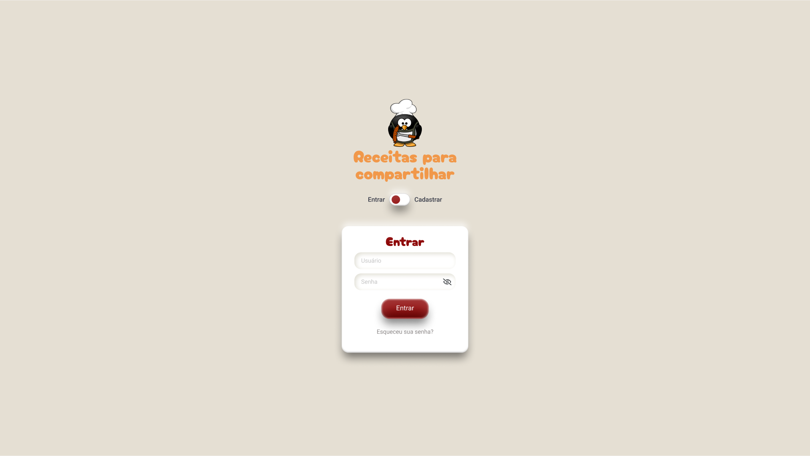  
    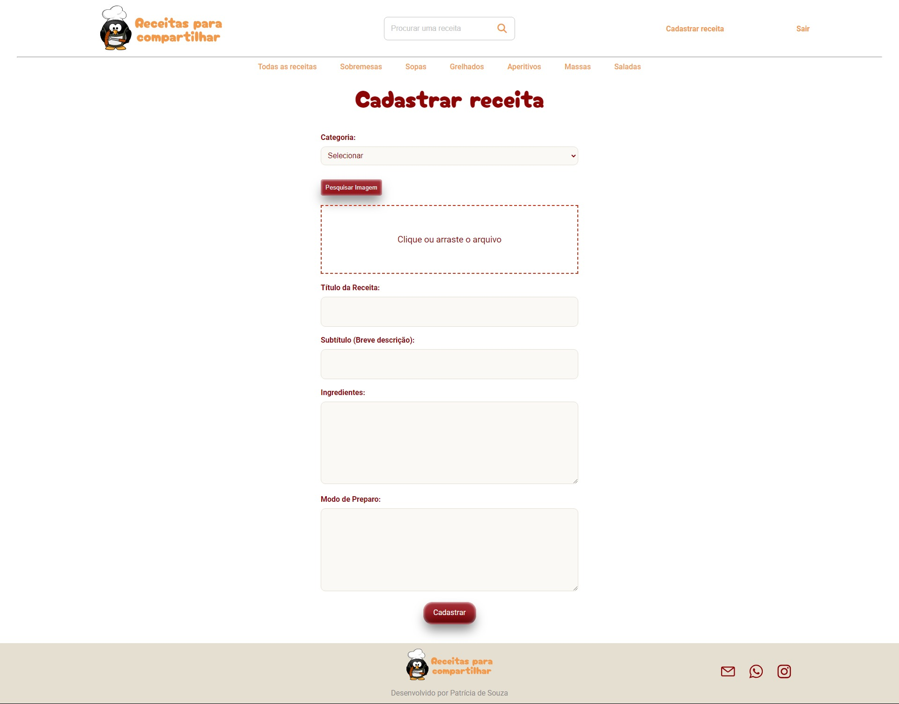  
    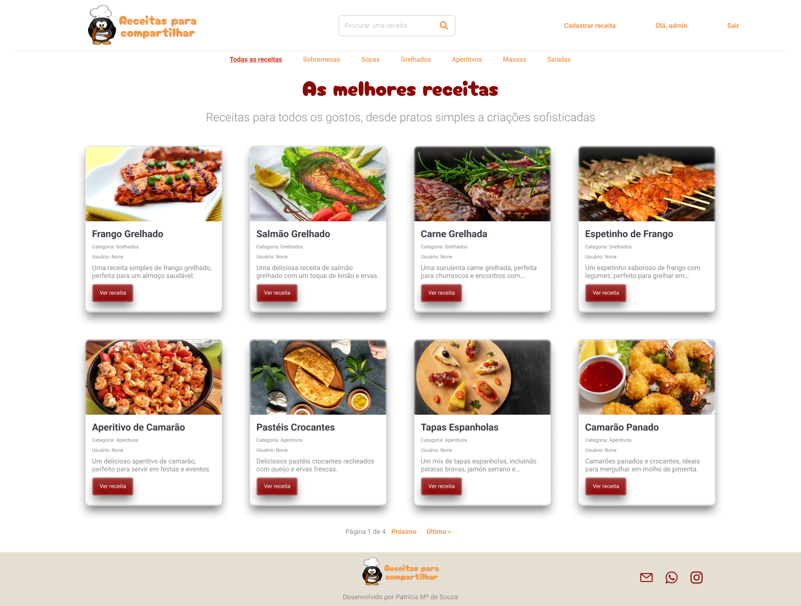  
    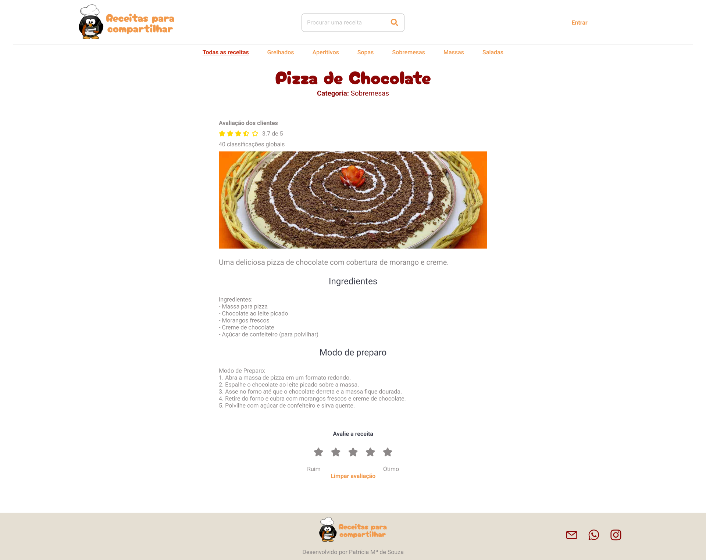  
    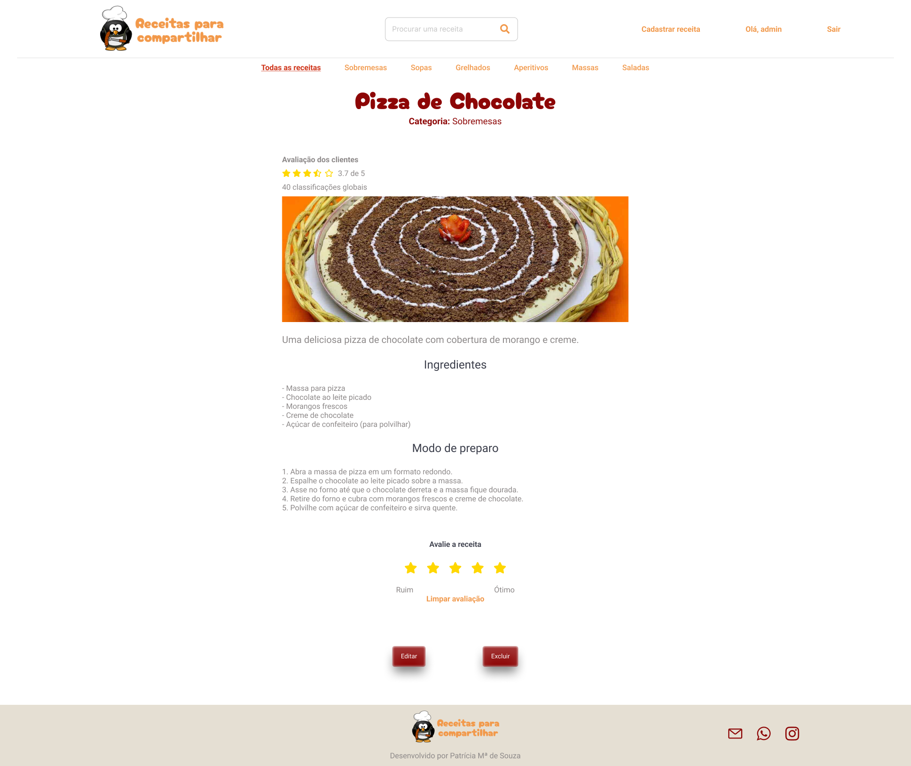  
    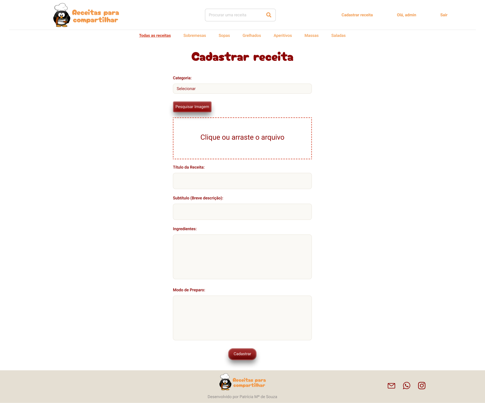  

    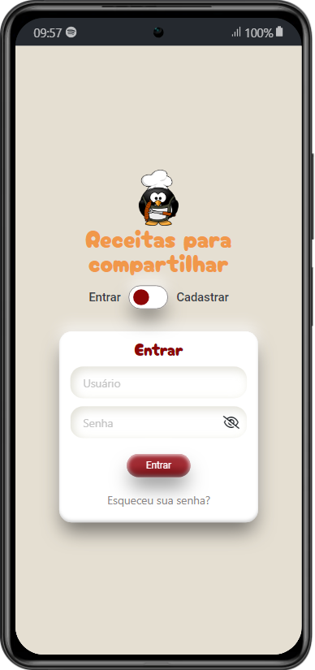  
    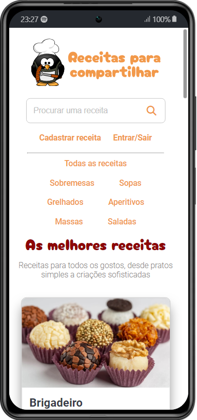  
    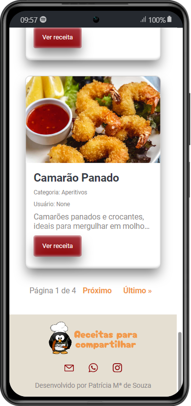  
    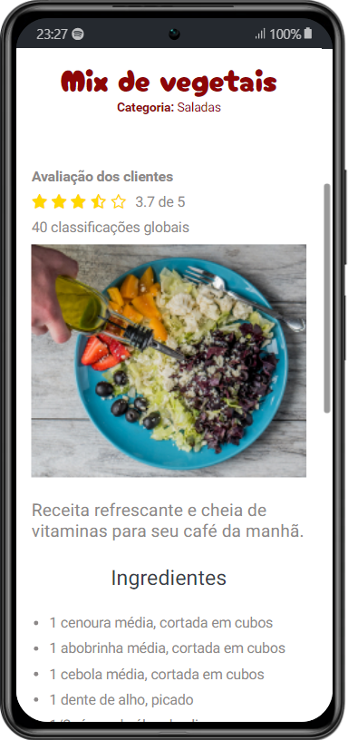  
    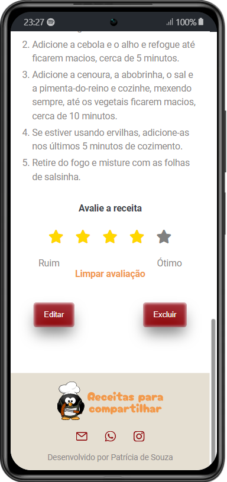  
    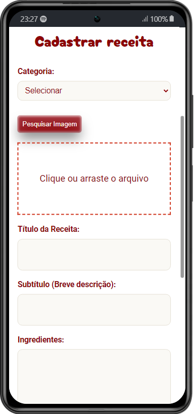  

## :memo: Licença

Esse projeto está sob a licença MIT.
